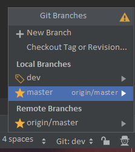

## bibun/bibunandroid

### Contributing
Werk altijd eerst op de dev branch. Als een feature volledig werkt en geïmplementeerd is
kan deze gemerged worden naar master.  
Je kan de huidige branch vinden rechts vanonder in android studio onder `remote branches`.

Dan kan je gewoon pushen en dan zal het op die branch komen.
